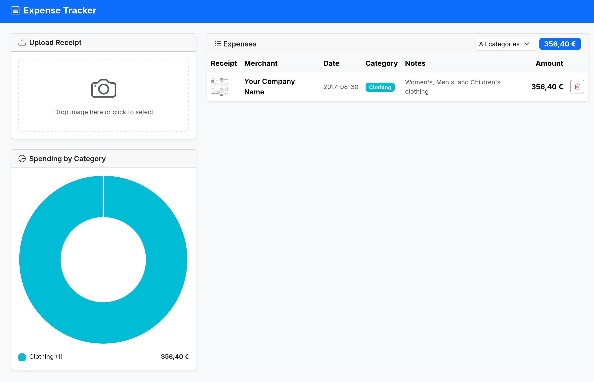

# Expense Tracker

Upload a photo of a receipt. A VLM (Google Gemini via OpenRouter) reads it,
extracts the total and merchant, and classifies the expense into a category.

**Stack:** FastAPI · SQLite · LangChain · Bootstrap 5 · Chart.js

**Tests:** 13 integration tests (pytest + pytest-mock) · 6 E2E tests (Playwright)

---



---

## Features

- Drag-and-drop receipt upload (JPEG, PNG, WebP)
- VLM extracts amount, merchant, date, and category automatically
- Spending breakdown by category (donut chart)
- Filter expenses by category
- Delete individual expenses

---

## QA Focus

- **Mocking external dependencies** — the VLM call is mocked in all integration tests to keep them fast and deterministic, with no real API calls
- **Integration tests hit a real (isolated temp) database** — no mocked DB
- **E2E tests** cover the full upload → display → delete → filter flow
- Discovered and fixed a real bug during testing: SQLite timestamp precision caused flaky ordering in the expense list

---

## Running the App

Requires an OpenRouter API key:

```bash
cp .env.example .env  # add your OPENROUTER_API_KEY
uv run uvicorn main:app --reload
```

Or with Docker:

```bash
docker compose up
```

Open [http://localhost:8000](http://localhost:8000)

---

## Running the Tests

```bash
# Integration tests
uv run pytest tests/test_api.py -v

# E2E tests (requires Playwright browsers)
uv run playwright install chromium
uv run pytest tests/test_e2e.py -v
```
